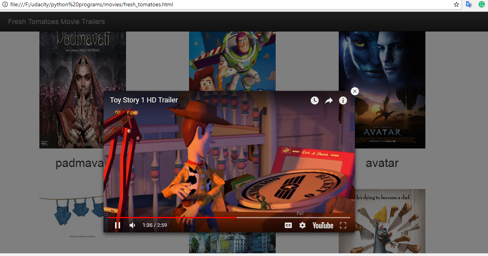

# Movie_trailer_website
this will show movies posters which are statically added using python code. when we click on the poster it will show trailer of that movie.

## Example 

## code files
#### media.py

* Having class variables title(for storing title of movie) , storyline(a short description about movie) , poster_image_url(link to the poster image) , trailer_youtube_url(link to the youtube trailer)

* Having a method show_trailer()(to open trailer in browser window)

#### entertainment_center.py

Objects for different movies are created and intialized using constructors.

## Steps to run the application
1 install python  
2 clone the repository  
3 to build the page open the file entertainment_center.py  
4 run entertainment_center.py file in idle or etc.  
5 when you run entertainment_center.py it will generates html file and a page will open automatically in browser  
6 if you have html file you can open html page directly with any browser 

## To add more movies in page 

* open entertainment_center.py
* create a new object and intialize it using constructor e.g. movie_name = media.Movie(movie_title, movie_storyline, image_url, youtube_url)
* add the movie_name to movies list e.g. movies = [toy_story, avatar]
* run entertainment_center.py
* run index.html
